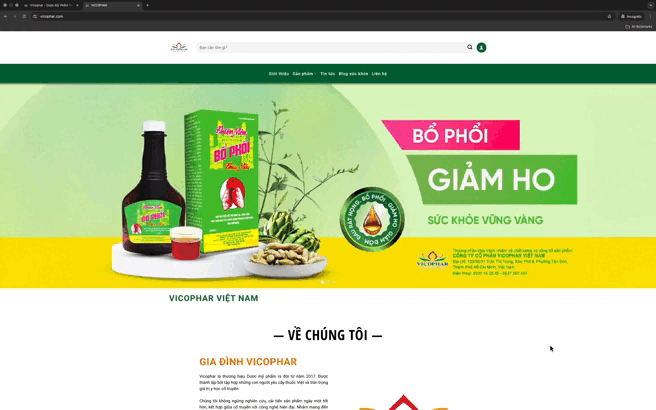

# Vicophar Vietnam - Premium Frontend Architecture - REMAKE - NO CLEAN CODE


Chào mừng đến với **Source Code Frontend** của [Vicophar Vietnam](https://vicophar.com).
Đây chỉ là source base, không clean code, clone về máy vẫn chạy bình thường. Để bảo mật dữ liệu thì source clean sẽ để private.
Dự án được thiết kế theo tư duy **Product-First**, tập trung tối đa vào Trải nghiệm người dùng (UX), Hiệu năng (Performance) và khả năng mở rộng (Scalability).

---

## 🎬 Project Showcase

> [!NOTE]
> So sánh trực quan sự lột xác về giao diện và trải nghiệm.

| **✨ New Interface (Modern & Clean)** | **📼 Legacy Interface (Old)** |
|:---------------------------:|:---------------------------:|
|  |  |
| *Smooth Animations, Clean Layout, 100% Responsive* | *Basic Layout, Standard UX* |

---

## 🛠 Engineering Stack (Công nghệ lõi)

Không chỉ là một trang web tĩnh, đây là một **Web Application** tối ưu sâu:

### Core Framework
-   **Next.js 16 (App Router)**: Tận dụng sức mạnh của React Server Components (RSC) để giảm JS Bundle Size.
-   **Structure**: Tổ chức theo Feature-based (`components/pages`, `components/layouts`) giúp code dễ đọc, dễ maintain.

### Advanced Styling System
-   **Tailwind CSS v4**: Cấu hình theo hướng "CSS-first" với các file split rõ ràng (`base.css`, `components.css`, `animations.css`).
-   **Modular Design**: Tái sử dụng triệt để các token màu sắc, typography (Google Sans, Be Vietnam Pro).
-   **Responsive First**: Grid & Flexbox system chuẩn cho Mobile -> Tablet -> Desktop.

### Interactive Ecosystem (UX Highlight)
-   **Custom Hooks Collection**:
    -   `useBodyScrollLock`: Xử lý khóa cuộn thông minh (fix lỗi layout shift trên iOS).
    -   `useFixedHeader` & `useHeroSticky`: UX Navigation mượt mà khi cuộn trang.
    -   `useDesktopDetection`: Tối ưu trải nghiệm riêng biệt cho từng loại thiết bị.
-   **UI Libraries**:
    -   **Embla Carousel**: Carousel vuốt chạm cực mượt (60fps).
    -   **Lottie Web**: Animation vector nhẹ và sắc nét.
    -   **Radix UI**: Accessible primitives cho Modal/Dialog.

---

## 🚀 Key Features (Tính Năng Đắt Giá)

### 1. Performance Mastery (95+ Lighthouse)
-   **LCP Optimized**: Banner Hero được preload và xử lý priority.
-   **Zero Layout Shift (CLS)**: Skeleton Loading và kích thước ảnh (`sizes` prop) được tính toán chính xác.
-   **Smart Lazy Loading**: Chỉ tải Components nặng (Map, Form) khi cần thiết.

### 2. "App-like" Mobile Experience
-   **Drawer Navigation**: Menu trượt mượt mà như Native App.
-   **Touch Interactions**: Các nút bấm, slider được tối ưu vùng chạm (Hit area).
-   **Scroll Restoration**: Giữ vị trí đọc khi back lại trang trước.

### 3. SEO Standard (Dược Mỹ Phẩm)
-   **Semantic HTML**: Cấu trúc thẻ (`main`, `article`, `section`) chuẩn SEO.
-   **Dynamic Metadata**: Title & Description thay đổi theo từng trang sản phẩm/bài viết.

---

## 📂 Architecture Overview

Cấu trúc thư mục được quy hoạch bài bản cho dự án lớn:

```bash
src/
├── app/                    # Next.js App Router
│   ├── fonts/              # Local Fonts optimization
│   ├── layout.js           # Global Layout & Metadata
│   └── page.js             # Server-side Homepage
├── components/
│   ├── common/             # Atomic Components (Button, Card, Modal)
│   ├── layouts/            # Header, Footer, Sidebar, Wrappers
│   └── pages/              # Page-specific Sections (Home/Contact/Product)
├── hooks/                  # Custom React Hooks (Business Logic)
├── styles/                 # Modular CSS System
└── scripts/                # Utility scripts
```

---

## 🔧 Developer Guide

**1. Khởi tạo dự án:**
```bash
pnpm install
# Khuyến khích dùng pnpm để quản lý gói nhanh và an toàn hơn
```

**2. Phát triển (Development):**
```bash
pnpm dev
# Server chạy tại: http://localhost:3000
```

**3. Đóng gói (Production Build):**
```bash
pnpm rebuild
# Lệnh tắt cho: clean -> build -> start
```

---

## 📝 Contribution & Conventions

-   **Commit Message**: Sử dụng [Conventional Commits](https://www.conventionalcommits.org/) (`feat`, `fix`, `refactor`, `style`).
-   **State Management**: Ưu tiên React State & Context API, hạn chế Redux nếu không cần thiết.
-   **Clean Code**: DRY (Don't Repeat Yourself) & KISS (Keep It Simple, Stupid).

---
*Crafted with ❤️ for Doan Quang Minh*
